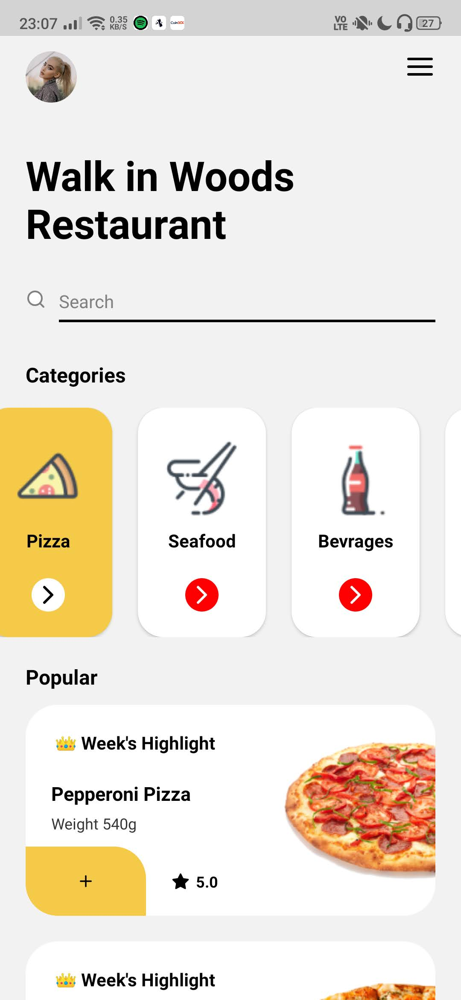
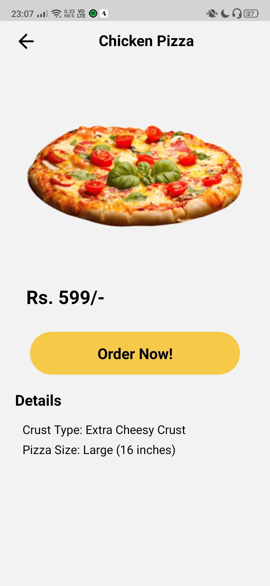

# Food Delivery Application
A mobile front-end application for food delivery. It is built on **React Native** and can work on both iOS and Android.

## Steps to install
1. Clone the repository
2. In same directory, use `npm install` to install all dependencies.
3. Use `npm start` to run the application.

You need **Expo** or Android Emulator / iOS Emulator for this application to work

## Screenshots from the application

